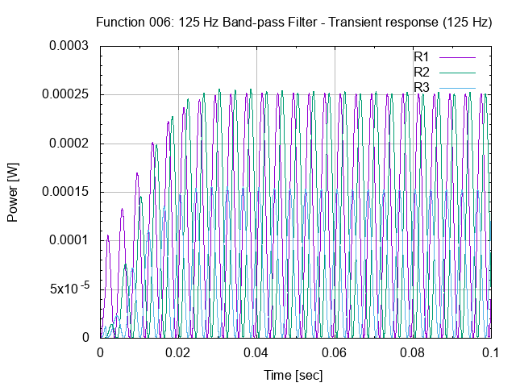

# 26 Octave Filter

## Specification.

### Description.

The octave filter is to separate a pre-amplified audio signal into 10
frequency bands.

This is done by using band pass filter and detector modules.

The modules are paired on a daughter board pcb, which is plugged into a
socket (female header) on the main pcb.

### Functions.

ID  | Description               |
----|---------------------------|
001 | Pre-amplifier.            |
002 | 31.5 Hz band pass filter. |
003 | Detector.                 |
004 | 63 Hz band pass filter.   |
005 | Detector.                 |
006 | 125 Hz band pass filter.  |
007 | Detector.                 |
008 | 250 Hz band pass filter.  |
009 | Detector.                 |
010 | 500 Hz band pass filter.  |
011 | Detector.                 |
012 | 1 kHz band pass filter.   |
013 | Detector.                 |
014 | 2 kHz band pass filter.   |
015 | Detector.                 |
016 | 4 kHz band pass filter.   |
017 | Detector.                 |
018 | 8 kHz band pass filter.   |
019 | Detector.                 |
020 | 16 kHz band pass filter.  |
021 | Detector.                 |
101 | Power On/Off switch.      |

### Modes of operation.

ID  | Description                                  |
----|----------------------------------------------|
001 | Reset: resets all filter modules.            |
002 | Follow: all filters follow the input signal. |

### Inputs.

ID   | Description                        | Location   |
-----|------------------------------------|------------|
J101 | DIN 41617 31-pin connector (male). | main pcb.  |
J102 | BNC connector (male).              | front pcb. |

### Controls.

ID   | Description                        | Location   |
-----|------------------------------------|------------|
S101 | Power on/off switch.               | front pcb. |
S102 | Follow/Reset switch.               | front pcb. |
R110 | Reference voltage level control.   | front pcb. |

### Outputs.

ID   | Description                        | Location   |
-----|------------------------------------|------------|
J002 | 10-pin connector (female).         | front pcb. |

### Indicators.

ID   | Description                          | Location   |
-----|--------------------------------------|------------|
D104 | LED indicates the "power on" status. | front pcb. |

### Power supply.

Power (+15 V DC/- 15 V DC) is obtained from the back panel bus.

### Protection and fail-safes.

ID   | Description                          | Location |
-----|--------------------------------------|----------|
.    | .                                    | .        |

### Replaceable parts.

ID   | Description                                                     | Location  |
-----|-----------------------------------------------------------------|-----------|
U101 | CA3140E operational amplifier in 8 pin DIP 300 mil wide socket. | main pcb. |
A101 | Filter module in 8 pin SIL socket.                              | main pcb. |
A102 | Filter module in 8 pin SIL socket.                              | main pcb. |
A103 | Filter module in 8 pin SIL socket.                              | main pcb. |
A104 | Filter module in 8 pin SIL socket.                              | main pcb. |
A105 | Filter module in 8 pin SIL socket.                              | main pcb. |

### Connectors.

ID    | Description                          | Location   |
------|--------------------------------------|------------|
J001  | DIN 41617 31-pin connector (male).   | main pcb.  |
J002  | 10-pin connector (female).           | front pcb. |
TP101 | Test point for GND.                  | main pcb.  |
TP102 | Test point for GND.                  | front pcb. |

### Physical dimensions and form factors.

Description           | Dimensions                      |
----------------------|---------------------------------|
Main pcb form factor  | Eurocard 3 HE: 160 mm x 100 mm. |
Front pcb form factor | Eurocard 3 HE x 10 TE.          |

## Basic Design.

### Schematic entry.

#### Schematic files.

Schematics are prepared with gschem version 1.6.2.20110115, a schematic
entry application part of the GPL'd EDA suite of tools "gschem and
friends" (geda-gaf).

Attributes for symbols are managed either from within gschem, or with
gattrib, the attribute editing application from the same suite of tools.

#### Design Rule Check.

After schematic entry a check is done by running gnetlist with the
"geda" backend as to visually check for missing reference designators,
missing device values, shorted nets and not connected pins on symbols.

The gnetlist backend "geda" will list components, renamed nets, and
resulting connectivity of nets in a structured list.

### Calculations.

...

### Simulations.

#### gnucap simulations.

##### Schematic files (graphic representation only).

Schematic representations of circuits for simulation were prepared with
gschem.

##### Input files.

Various circuit files (*.ckt) contain subcircuits (operational
amplifier) and calls to (diode and transistor) models included in the
gnucap software package.

##### Data files.

For every module, section and response type, a single data file was
generated by gnucap by means of a Makefile rule.

##### Data processing files.

For every required output graph a gnuplot post processing job was done.

##### Output files.

Output files are typically Portable Network Graphic files (*.png).

Default size of graphs is 640 by 480 pixels.

Detailed graphs were made where required.

##### Discussion of results.

All input files were processed with gnucap version 0.35 and all data
files were processed with gnuplot version 4.2 patchlevel 6.

###### 26.003 main board.

The main board consists of an input stage, five sockets for
filter+detector modules, and a voltage divider with diodes for a
reference voltage.

The sockets and voltage divider for a reference voltage were not
simulated.

----

Input stage.

The input stage consists of a single CA3140E operational amplifier with
feedback loop and dc filtering with a capacitor.

The input stage is simulated for both frequency and transient responses.

For the simulations a uA741 operational amplifier model was used.

The CA3140E is a "drop in" equivalent part for the uA741, and is both
pin and electrical equivalent.

The frequency response is limited on the X-axis to 10 MHz as the design
operates in the "audio frequency" domain and the simulated operational
amplifier has an upper frequency limit of 4.5 MHz (see datasheet).

The transient responses are simulated with a ramp up (step) of 0.01
seconds in the power supply (+/- 15 V DC) for the operational amplifier,
as to investigate the power up of the input stage.

----

26.006 31.5 and 63 Hz filter and detector module.

This module consist of both a 31.5 Hz and a 63 Hz Band Pass Filter and
Detector sections.

**31.5 Hz Band Pass Filter and Detector section.**

**63 Hz Band Pass Filter and Detector section.**

----
125 Hz Band Pass Filter and Detector section.

#### ktechlab simulations.

### Breadboard prototyping.

A breadboard was prepared for testing.

Visualization was done with Fritzing version 0.6.3 (b08.16).

## Design For Manufacturing.

### Schematic entry.

#### Schematic files.

...

#### Design Rule Check.

...

#### Netlists.

Connectivity for the pcb layout editor is generated with gnetlist from
the schematics.

Pin renaming for the pcb layout editor is generated with gnetlist from
the schematics.

#### Bill Of Materials.

...

### Printed Circuit Board design.

#### Layout files.

#### Visual Testing files.

#### Design Rules Check.

...

#### Gerber files.

...

#### Bill Of Materials.

...

#### Pick-and-Place files.

...

#### IPC-D-356 netlist files.

...

## Manufacturing.

### Printed Circuit Boards.

#### Quotations.

...

#### OSH Park.

#### QA/QC Testing.

...

### Printed Circuit Assembly.

#### Quotations.

...

#### Purchase Orders.

...

#### QA/QC Testing.

...

## Testing and Test Records.

...

# Appendix A: Pinout DIN 41617 31-pin connector.

Pin | Netname        | Description                      |
----|----------------|----------------------------------|
1   | MUX_OUT        | Multiplexer output               |
2   | REG_OUT        | Storage register output          |
3   | DB_OUT         | dB output                        |
4   | NOISE_OUT      | Noise Generator output           |
5   | RFUNCGEN_OUT   | Random Function Generator output |
6   | AM_OUT         | AM output                        |
7   | BURST_OUT      | Burst Generator output           |
8   | SWEEP_OUT      | Sweep Generator output           |
9   | FUNC_OUT       | Function Generator output        |
10  | AMPL_OUT       | Amplitude output                 |
11  | FUNC_0CR       | Function Generator zero crossing |
12  | SWEEP_SYNC     | Sweep synchronisation            |
13  | BURST_OUT      | Burst synchronisation            |
14  | DP_CODE        | Decimal Point code               |
15  | CH_DBL         | Channel doubleing                |
16  | MUX_CLOCK      | Multiplexer clock                |
17  | MUX_RESET      | Multiplexer reset                |
18  | INHIBIT        | +/- inhibit                      |
19  | DM_IN          | Digital Meter input              |
20  | DM_COMMON      | Digital Meter common             |
21  | LM_IN          | LED Meter input                  |
22  | LM_COMMON      | LED Meter common                 |
23  | NEG_UVAR       | -Uvar                            |
24  | POS_UVAR       | +Uvar                            |
25  | POS_U          | +U                               |
26  | NEG_U          | -U                               |
27  | MAINS_230VAC_F | Mains supply 230 V AC phase      |
28  | MAINS_230VAC_N | Mains supply 230 V AC neutral    |
29  | NEG_15VDC      | -15 V DC                         |
30  | GND            | Ground                           |
31  | POS_15VDC      | +15 V DC                         |

