# 26 Octave Filter

Author: Bert Timmerman

Organisation: Me Organized ??

Date: 20180810

## Specification.

### Description.

The octave filter is to separate a pre-amplified audio signal into 10
frequency bands.

This is done by using band pass filter and detector modules.

The modules are paired on a daughter board pcb, which is plugged into a
socket (female header) on the main pcb.

### Functions.

ID  | Description               |
----|---------------------------|
001 | Pre-amplifier.            |
002 | 31.5 Hz band pass filter. |
003 | Detector.                 |
004 | 63 Hz band pass filter.   |
005 | Detector.                 |
006 | 125 Hz band pass filter.  |
007 | Detector.                 |
008 | 250 Hz band pass filter.  |
009 | Detector.                 |
010 | 500 Hz band pass filter.  |
011 | Detector.                 |
012 | 1 kHz band pass filter.   |
013 | Detector.                 |
014 | 2 kHz band pass filter.   |
015 | Detector.                 |
016 | 4 kHz band pass filter.   |
017 | Detector.                 |
018 | 8 kHz band pass filter.   |
019 | Detector.                 |
020 | 16 kHz band pass filter.  |
021 | Detector.                 |
101 | Power On/Off switch.      |

### Modes of operation.

ID  | Description                                  |
----|----------------------------------------------|
001 | Reset: resets all filter modules.            |
002 | Follow: all filters follow the input signal. |

### Inputs.

ID   | Description                        | Location   |
-----|------------------------------------|------------|
J301 | DIN 41617 31-pin connector (male). | main pcb.  |
J202 | BNC connector (male).              | front pcb. |

### Controls.

ID   | Description                        | Location   |
-----|------------------------------------|------------|
S201 | Power on/off switch.               | front pcb. |
S202 | Follow/Reset switch.               | front pcb. |
R407 | Level control input signal         | front pcb  |
R310 | Reference voltage level control.   | main pcb.  |

### Outputs.

ID   | Description                        | Location   |
-----|------------------------------------|------------|
J002 | 34-pin connector (female).         | front pcb. |

### Indicators.

ID   | Description                          | Location   |
-----|--------------------------------------|------------|
D204 | LED indicates the "power on" status. | front pcb. |

### Power supply.

Power (+15 V DC/- 15 V DC) is obtained from the back panel bus.

### Protection and fail-safes.

ID   | Description                          | Location |
-----|--------------------------------------|----------|
.    | .                                    | .        |

### Replaceable parts.

ID   | Description                                                     | Location  |
-----|-----------------------------------------------------------------|-----------|
U301 | CA3140E operational amplifier in 8 pin DIP 300 mil wide socket. | main pcb. |
A301 | Filter module in 8 pin SIL socket.                              | main pcb. |
A302 | Filter module in 8 pin SIL socket.                              | main pcb. |
A303 | Filter module in 8 pin SIL socket.                              | main pcb. |
A304 | Filter module in 8 pin SIL socket.                              | main pcb. |
A305 | Filter module in 8 pin SIL socket.                              | main pcb. |

### Connectors.

ID    | Description                          | Location   |
------|--------------------------------------|------------|
J301  | DIN 41617 31-pin connector (male).   | main pcb.  |
J202  | 34-pin connector (female).           | front pcb. |
TP301 | Test point for GND.                  | main pcb.  |
TP202 | Test point for GND.                  | front pcb. |

### Physical dimensions and form factors.

Description           | Dimensions                      |
----------------------|---------------------------------|
Main pcb form factor  | Eurocard 3 HE: 160 mm x 100 mm. |
Front pcb form factor | Eurocard 3 HE x 10 TE.          |

## Basic Design.

### Schematic entry.

#### Schematic files.

Schematics are prepared with gschem version 1.6.2.20110115, a schematic
entry application part of the GPL'd EDA suite of tools "gschem and
friends" (geda-gaf).

Attributes for symbols are managed either from within gschem, or with
gattrib, the attribute editing application from the same suite of tools.

#### Design Rule Check.

After schematic entry a check is done by running gnetlist with the
"geda" backend as to visually check for missing reference designators,
missing device values, shorted nets and not connected pins on symbols.

The gnetlist backend "geda" will list components, renamed nets, and
resulting connectivity of nets in a structured list.

### Calculations.

...

### Simulations.

#### gnucap simulations.

##### Schematic files (graphic representation only).

Schematic representations of circuits for simulation were prepared with
gschem.

##### Input files.

Various circuit files (*.ckt) contain subcircuits (operational
amplifier) and calls to (diode and transistor) models included in the
gnucap software package.

##### Data files.

For every module, section and response type, a single data file was
generated by gnucap by means of a Makefile rule.

##### Data processing files.

For every required output graph a gnuplot post processing job was done.

##### Output files.

Output files are typically Portable Network Graphic files (*.png).

Default size of graphs is 640 by 480 pixels.

Detailed graphs were made where required.

##### Discussion of results.

All input files were processed with gnucap version 0.35 and all data
files were processed with gnuplot version 5.2 patchlevel 8.

###### Function 000: Octave filter (complete).

The main board consists of an input stage (pre-amplifier), five sockets for
filter+detector modules, and a voltage divider with diodes for a
reference voltage.

The sockets and voltage divider for a reference voltage were not
simulated.

----

###### Function 001: Pre-amplifier.

The input stage consists of a single CA3140E operational amplifier with
feedback loop and DC filtering with a capacitor.

The input stage is simulated for both frequency and transient responses.

For the simulations a uA741 operational amplifier model was used.

The CA3140E is a "drop in" equivalent part for the uA741, and is both
pin and electrical equivalent.

The frequency response is limited on the X-axis to 10 MHz as the design
operates in the "audio frequency" domain and the simulated operational
amplifier has an upper frequency limit of 4.5 MHz (see datasheet).

The transient responses are simulated with a ramp up (step) of 0.01
seconds in the power supply (+/- 15 V DC) for the operational amplifier,
as to investigate the power up of the input stage.

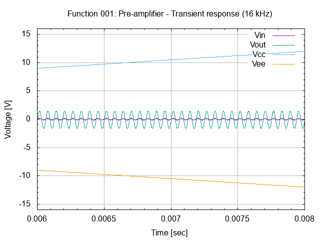

----

###### Function 002: 31.5 Hz Band-pass Filter.

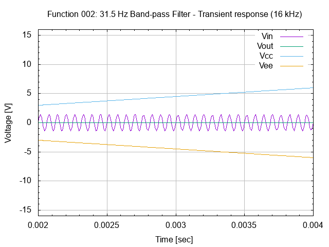

----

###### Function 003: 31.5 Hz Detector.

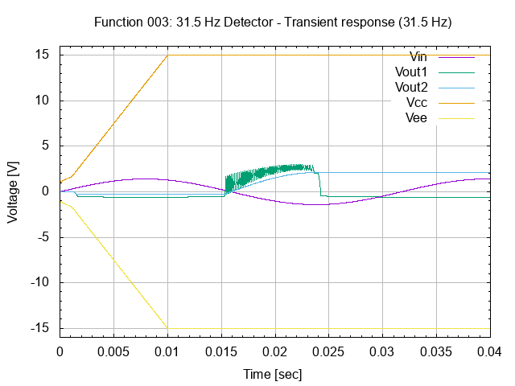

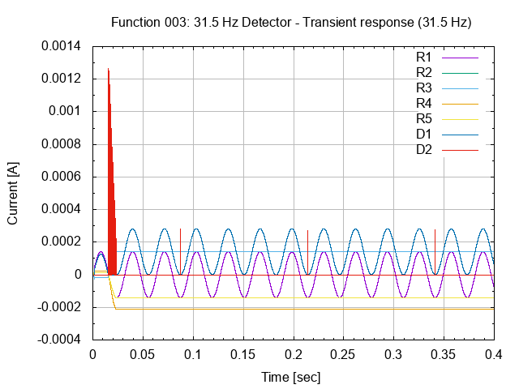

----

###### Function 004: 63 Hz Band-pass Filter.

----

###### Function 005: 63 Hz Detector.

----

###### Function 006: 125 Hz Band-pass Filter.

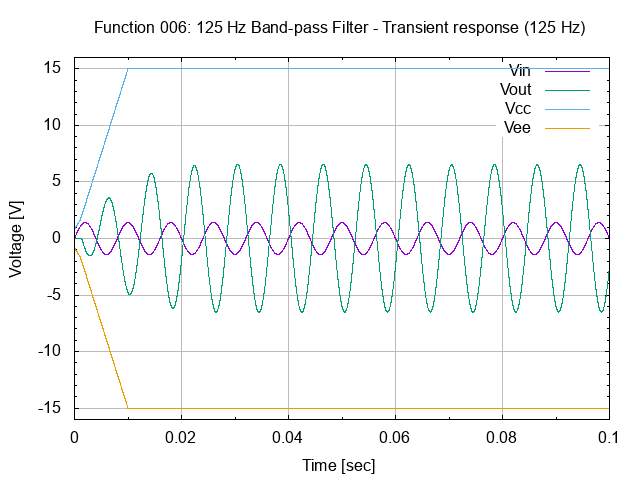

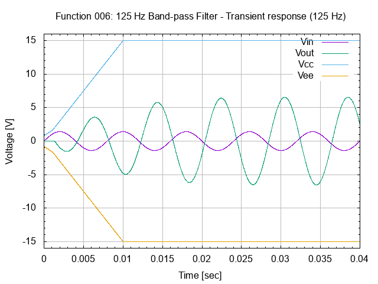

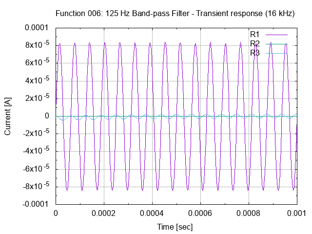

----

###### Function 007: 125 Hz Detector.

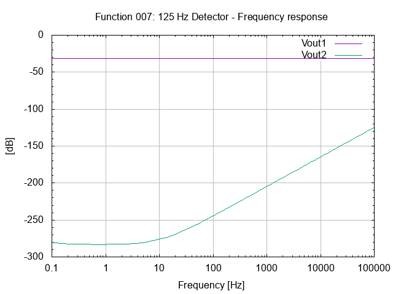

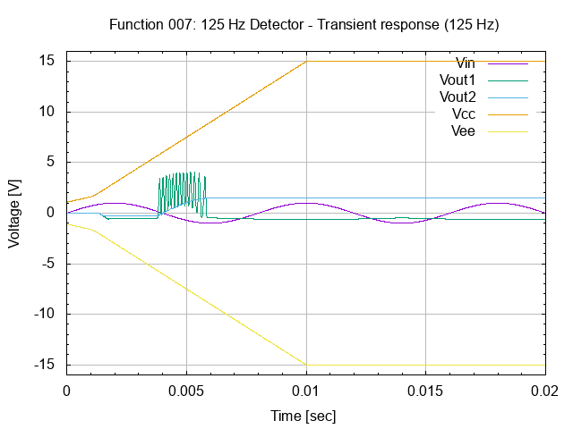

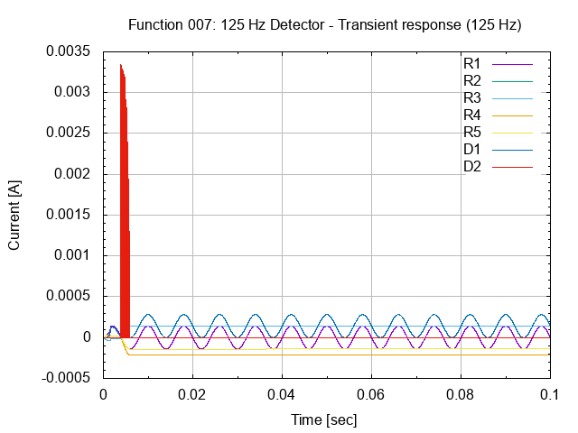

----

###### Function 008: 250 Hz Band-pass Filter.

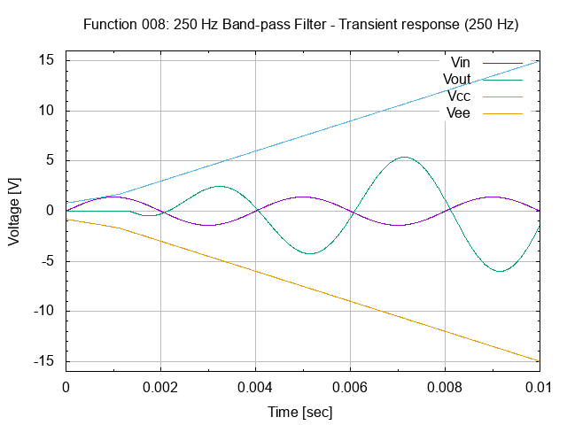

----

###### Function 009: 250 Hz Detector.

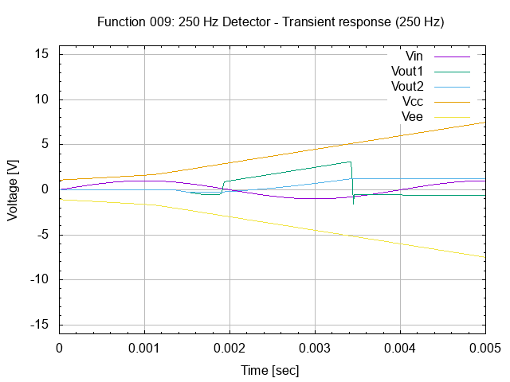

----

###### Function 010: 500 Hz Band-pass Filter.

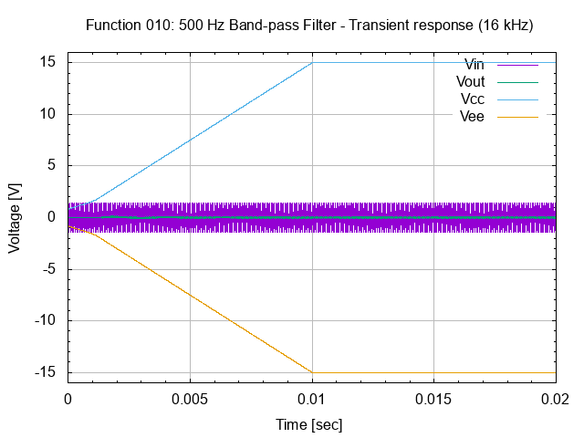

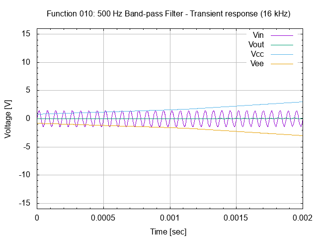

----

###### Function 011: 500 Hz Detector.

----

###### Function 012: 1 kHz Band-pass Filter.

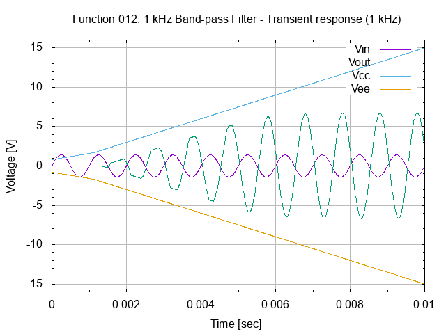

----

###### Function 013: 1 kHz Detector.

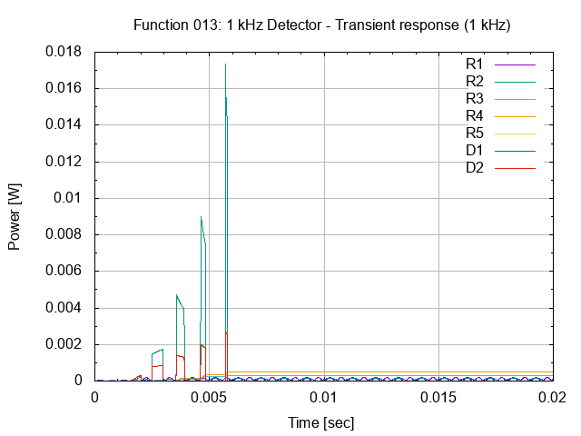

----

###### Function 014: 2 kHz Band-pass Filter.

----

#### ktechlab simulations.

### Breadboard prototyping.

A breadboard was prepared for testing.

Visualization was done with Fritzing version 0.6.3 (b08.16).

## Design For Manufacturing.

### Schematic entry.

#### Schematic files.

...

#### Design Rule Check.

...

#### Netlists.

Connectivity for the pcb layout editor is generated with gnetlist from
the schematics.

Pin renaming for the pcb layout editor is generated with gnetlist from
the schematics.

#### Bill Of Materials.

...

### Printed Circuit Board design.

#### Layout files.

[link to layout files](../ecad/pcb/)

#### Visual Testing files.

[link to eyecandy](../ecad/pcb/eyecandy/)

#### Design Rules Check.

...

#### Gerber files.

...

#### Bill Of Materials.

...

#### Pick-and-Place files.

...

#### IPC-D-356 netlist files.

...

## Manufacturing.

### Printed Circuit Boards.

#### Quotations.

[link to OSH Park fabrication services](purchase/OSH_Park/fabrication_services.md)

#### OSH Park.

[link to OSH Park directory](purchase/OSH_Park/)

#### QA/QC Testing.

...

### Printed Circuit Assembly.

#### Quotations.

...

#### Purchase Orders.

...

#### QA/QC Testing.

...

## Testing and Test Records.

...

# Appendix A: Pinout DIN 41617 31-pin connector.

Pin | Netname        | Description                      |
----|----------------|----------------------------------|
1   | MUX_OUT        | Multiplexer output               |
2   | REG_OUT        | Storage register output          |
3   | DB_OUT         | dB output                        |
4   | NOISE_OUT      | Noise Generator output           |
5   | RFUNCGEN_OUT   | Random Function Generator output |
6   | AM_OUT         | AM output                        |
7   | BURST_OUT      | Burst Generator output           |
8   | SWEEP_OUT      | Sweep Generator output           |
9   | FUNC_OUT       | Function Generator output        |
10  | AMPL_OUT       | Amplitude output                 |
11  | FUNC_0CR       | Function Generator zero crossing |
12  | SWEEP_SYNC     | Sweep synchronisation            |
13  | BURST_OUT      | Burst synchronisation            |
14  | DP_CODE        | Decimal Point code               |
15  | CH_DBL         | Channel doubleing                |
16  | MUX_CLOCK      | Multiplexer clock                |
17  | MUX_RESET      | Multiplexer reset                |
18  | INHIBIT        | +/- inhibit                      |
19  | DM_IN          | Digital Meter input              |
20  | DM_COMMON      | Digital Meter common             |
21  | LM_IN          | LED Meter input                  |
22  | LM_COMMON      | LED Meter common                 |
23  | NEG_UVAR       | -Uvar                            |
24  | POS_UVAR       | +Uvar                            |
25  | POS_U          | +U                               |
26  | NEG_U          | -U                               |
27  | MAINS_230VAC_F | Mains supply 230 V AC phase      |
28  | MAINS_230VAC_N | Mains supply 230 V AC neutral    |
29  | NEG_15VDC      | -15 V DC                         |
30  | GND            | Ground                           |
31  | POS_15VDC      | +15 V DC                         |

# Appendix B: Operational Amplifiers.

## Operational Amplifier basics.

Operational amplifiers are one of the workhorses of the analogue
electronics scene.

Op-amps, as they are also known are widely available in the form of
integrated circuits, many costing only a few cents or a few pence for
the standard versions.

High performance op amp integrated circuits still offer excellent value
for money, but obviously cost a little more.

In view of their ease of use and low cost, these integrated circuits are
used in vast quantities enabling high performance electronics circuits
to be developed and designed with a minimum of electronics components.

Operational amplifiers, op amps are virtually the ideal amplifier.

They provide a combination of parameters that are of great use:

  - Very high gain
  - Very high input impedance
  - Very low output impedance

The operational amplifier is what is known as a differential amplifier.

The differential amplifier has two inputs and this enables it to be used
in a wide number of circuit configurations.

The circuit symbol for an operational amplifier consists simply of a
triangle as shown below.

The two inputs are designated by "+" and "-" symbols, and the output of
the operational amplifier is at the opposite end of the triangle.

Inputs from the "+" input appear at the output in the same phase,
whereas signals present at the "-" input appear at the output inverted
or 180 degrees out of phase.

This gives rise to the names for the inputs.

The "+" input is known as the non-inverting input, while the "-" input
is the inverting input of the operational amplifier.

As the output from the amplifier is dependent upon the difference in
voltage between the two inputs, it is known as a differential amplifier.

Often the power supply rails for the operational amplifier are not shown
in circuit diagrams and there is no connection for a ground line.

The power rails for the operational amplifier are assumed to be
connected.

The power for the operational amplifier is generally supplied as a
positive rail and also a negative rail.

Often voltages of +15 V and -15 V are used, although this will vary
according to the application and the actual chip used.

The gain of the operational amplifier is very high.

Figures for the levels of gain provided by an operational amplifier on
its own are very high.

Typically they may be upwards of 10 000.

While levels of gain may be too high for use on their own, the
application of feedback around the operational amplifier enables the
circuit to be used in a wide variety of applications, from very flat
amplifiers, to filters, oscillators, switches, and much more.

## Op-amp open loop gain.

The gain of an operational amplifier is exceedingly high.

Normally feedback is applied around the op-amp so that the gain of the
overall circuit is defined and kept to a figure which is more usable.

However the very high level of gain of the op-amp enables considerable
levels of feedback to be applied to enable the required performance to
be achieved.

When measured the open loop gain of an operational amplifier falls very
rapidly with increasing frequency.

Typically an op-amp may have an open loop gain of around 100 000, but
this usually starts to fall very quickly.

For the famous 741 operational amplifier, it starts to fall at a
frequency of only 10 Hz.

## Op-amp slew rate.

With very high gains the operational amplifiers have what is termed
compensation capacitance to prevent oscillation.

This capacitance combined with the limited drive currents mean that the
output of the amplifier is only able to change at a limited rate, even
when a large or rapid change occurs at the input.

This maximum speed is known as the slew rate.

A typical general purpose device may have a slew rate of
10 V / microsecond.

This means that when a large step change is placed on the input, the
device would be able to provide an output 10 volt change in one
microsecond.

The figures for slew rate change are dependent upon the type of
operational amplifier being used.

Low power op-amps may only have a slew rate of a volt per microsecond,
whereas there are fast operational amplifiers capable to providing slew
rates of 1000 V / microsecond.

The slew rate can introduce distortion onto a signal by limiting the
frequency of a large signal that can be accommodated.

It is possible to find the maximum frequency or voltage that can be
accommodated.

A sine wave with a frequency of f Hertz and amplitude V volts requires
an operational amplifier with a slew rate of 2 x pi x V x V volts per
second.

## Offset null.

One of the minor problems with an operational amplifier is that they
have a small offset.

Normally this is small, but it is quoted in the datasheets for the
particular operational amplifier in question.

It is possible to null this using an external potentiometer connected to
the three offset null pins.

In most applications no provision is made for the offset null.

This is because it is normally not a problem and it adds further
components and an adjustment.

However it can be a problem where large levels of DC gain are required.

Here the offset voltage is amplified by the gain and could appear as a
significant voltage at the output.

## Op-amp circuits.

There is a huge variety of electronics circuits that can be designed
using operational amplifiers.

These opamp circuits range from amplifiers to multivibrators,
integrators to comparators and oscillators to timers.

It shows how versatile these op-amp integrated circuits are.

All these different circuits tend to use the high input impedance, low
output impedance and high gain of the op-amp, combined with the fact
that the operational amplifier is a differential amplifier.

In most circuits, feedback (usually negative feedback) is placed around
the op-amp and the way this is done provides the required function.

Only in very few applications is no feedback applied.

## Operational amplifier packages.

The packages in which electronics components are available is very
important.

Many electronics components are available in a wide variety of package
styles, and the operational amplifier is not exception.

Like many other electronics components, a vast number are used as
surface mount components in mass produced electronics products.

They are available in the SOIC (small outline integrated circuit)
package as well as many others.

Some are even available in five leaded versions of transistor packages
and this makes them ideal to drop into a circuit without using up much
board space.

However the more traditional style of electronics component packages are
also available.

They are available in the DIL (dual in line) package, often as a single
operational amplifier in an eight pin DIL, or duals in eight pin
packages (with no offset null connections) or fourteen or sixteen pin
DILs.

Operational amplifiers are in widespread use in analogue electronics
design and production.

These op-amps provide a particularly useful combination of circuit
parameters that make them an indispensable tool for the electronics design engineer.

While digital electronics is growing, the use of op-amps will
nevertheless remain in vast quantities as a result of their cost,
performance and ease of use.

These electronics components will therefore remain very cheap for many
years to come.

## Operational Amplifier Gain.

The gain of an operational amplifier or op-amp (opamp) circuit depends
upon a variety of factors including the circuit configuration as well as
the components around the operational amplifier chip itself.

This section gives a summary or overview of the gain of the different
operational amplifier circuits available.

### Inverting op-amp gain.

The circuit for the inverting op-amp circuit is shown below.

This circuit has the output 180 degrees out of phase with the input and
also provides a virtual earth input.

It is easy to derive the calculation for the op-amp gain.

The input to the op-amp itself draws no current and this means that the
current flowing in the resistors R1 and R2 is the same.

Using ohms law: Vout/R2 = -Vin/R1.

Hence the voltage gain of the circuit Av can be taken as:

Av = - R2 / R1

As an example, an amplifier requiring a gain of ten could be built by
making R2 = 47 k ohms and R1 = 4.7 k ohms.

### Non-Inverting Op-Amp gain.

The circuit for the non-inverting op-amp is shown below.

It offers a higher input impedance than the inverting opamp circuit.

The gain of the non-inverting circuit for the operational amplifier is
easy to determine.

The calculation hinges around the fact that the voltage at both inputs
is the same.

This arises from the fact that the gain of the amplifier is exceedingly
high.

If the output of the circuit remains within the supply rails of the
amplifier, then the output voltage divided by the gain means that there
is virtually no difference between the two inputs.

As the input to the op-amp draws no current this means that the current
flowing in the resistors R1 and R2 is the same.

The voltage at the inverting input is formed from a potential divider
consisting of R1 and R2, and as the voltage at both inputs is the same,
the voltage at the inverting input must be the same as that at the
non-inverting input.

This means that Vin = Vout x R1 / (R1 + R2)

Hence the voltage gain of the circuit Av can be taken as:

Av = 1 + R2 / R1

As an example, an amplifier requiring a gain of eleven could be built by
making R2 = 47 k ohms and R1 = 4.7 k ohms.

Op-amp gain or op-amp gain is very easy to determine.

The gain calculations for the different circuits is slightly different,
but essentially both circuits are able to offer similar levels of gain,
although the resistor values will not be the same for the same levels of
op-amp gain.

## Inverting operational amplifier.

Operational amplifiers can be used in a wide variety of circuit
configurations.

One of the most widely used is the inverting amplifier configuration.

It offers many advantages from being very simple to use, requiring just
the operational amplifier integrated circuit and a few other components.

Circuits are available for an inverting amplifier, and a non-inverting
amplifier.

This version details the inverting amplifier, where the output is the
mirror image of the input.

### Basic inverting circuit.

The basic circuit for the inverting operational amplifier circuit is
shown below.

It consists of a resistor from the input terminal to the inverting input
of the circuit, and another resistor connected from the output to the
inverting input of the op-amp.

The non inverting input is connected to ground.

In this circuit the non inverting input of the operational amplifier is
connected to ground.

As the gain of the operational amplifier itself is very very high and
the output from the amplifier is a matter of a few volts, this means
that the difference between the two input terminals is exceedingly small
and can be ignored.

As the non-inverting input of the operational amplifier is held at
ground potential this means that the inverting input must be virtually
at earth potential (i.e. a virtual earth).

As the input to the op-amp itself draws no virtually current this means
that the current flowing in the resistors R1 and R2 is the same.

Using Ohms law: Vout /R2 = -Vin/R1.

Hence the voltage gain of the circuit Av can be taken as:

Av = - R2 / R1

As an example, an amplifier requiring a gain of ten could be built by
making R2 = 47 k ohms and R1 = 4.7 k ohms.

Reminder:

It is worth mentioning at this point that for high levels of gain, the
gain bandwidth product of the basic op amp itself may become a problem.

With levels of gain of 100, the bandwidth of some operational amplifier
ICs may only be around 3 kHz.

Check the data sheet for the given chip being used before settling on
the level of gain.

## Non-inverting operational amplifier.

Operational amplifiers can be used in two basic configurations to create
amplifier circuits.

One is the inverting amplifier where the output is the inverse or 180
degrees out of phase with the input, and the other is the non-inverting
amplifier where the output is in the same sense or in phase with the
input.

Both operational amplifier circuits are widely used and they find
applications in different areas.

When an operational amplifier or op-amp is used as a non-inverting
amplifier it only requires a few additional components to create a
working amplifier circuit.

### Basic non-inverting op-amp circuit.

The basic non-inverting operational amplifier circuit is shown below.

In this circuit the signal is applied to the non-inverting input of the
op-amp.

However the feedback is taken from the output of the op-amp via a
resistor to the inverting input of the operational amplifier where
another resistor is taken to ground.

It is the value of these two resistors that govern the gain of the
operational amplifier circuit.

The gain of the non-inverting circuit for the operational amplifier is
easy to determine.

The calculation hinges around the fact that the voltage at both inputs
is the same.

This arises from the fact that the gain of the amplifier is exceedingly
high.

If the output of the circuit remains within the supply rails of the
amplifier, then the output voltage divided by the gain means that there
is virtually no difference between the two inputs.

As the input to the op-amp draws no current this means that the current
flowing in the resistors R1 and R2 is the same.

The voltage at the inverting input is formed from a potential divider
consisting of R1 and R2, and as the voltage at both inputs is the same,
the voltage at the inverting input must be the same as that at the
non-inverting input.

This means that Vin = Vout x R1 / (R1 + R2)

Hence the voltage gain of the circuit Av can be taken as:

Av = 1 + R2 / R1

As an example, an amplifier requiring a gain of eleven could be built by
making R2 = 47 k ohms and R1 = 4.7 k ohms.

### Input impedance of non-inverting amplifier.

It is often necessary to know the input impedance of a circuit.

The input impedance of this operational amplifier circuit is very high,
and may typically be well in excess of 10^7 ohms.

For most circuit applications this can be completely ignored.

This is a significant difference to the inverting configuration of an
operational amplifier circuit which provided only a relatively low
impedance dependent upon the value of the input resistor.

### AC coupling the non-inverting op-amp circuit.

In most cases it is possible to DC couple the circuit.

However in this case it is necessary to ensure that the non-inverting
has a DC path to earth for the very small input current that is needed.

This can be achieved by inserting a high value resistor, R3 in the
diagram, to ground as shown below.

The value of this may typically be 100 k ohms or more.

If this resistor is not inserted the output of the operational amplifier
will be driven into one of the voltage rails.

When inserting a resistor in this manner it should be remembered that
the capacitor-resistor combination forms a high pass filter with a
cut-off frequency.

The cut off point occurs at a frequency where the capacitive reactance
is equal to the resistance.

## Operational amplifier high pass filter.

Operational amplifiers lend themselves to being used for active filter
circuits, including a high pass filter circuit.

Using a few components they are able to provide high levels of
performance.

The simplest circuit high pass filter circuit using an operational
amplifier can be achieved by placing a capacitor in series with one of
the resistors in the amplifier circuit as shown.

The capacitor reactance increases as the frequency falls, and as a
result this forms a CR low pass filter providing a roll off of 6 dB per
octave.

The cut off frequency or break point of the filter can be calculated
very easily by working out the frequency at which the reactance of the
capacitor equals the resistance of the resistor.

This can be achieved using the formula:

Xc = 1 / 2 pi f C

where:

Xc is the capacitive reactance in ohms

pi is the greek letter and equal to 3.142

f is the frequency in Hertz

C is the capacitance in Farads

### Two pole high pass filter.

Although it is possible to design a wide variety of filters with
different levels of gain and different roll off patterns using
operational amplifiers, the filter described on this page will give a
good sure-fire solution.

It offers unity gain and a Butterworth response (the flattest response
in band, but not the fastest to achieve ultimate roll off out of band).

The calculations for the circuit values are very straightforward for the
Butterworth response and unity gain scenario (simple sure fire design in
the figure above, with Butterworth response and unity gain).

Critical damping is required for the circuit and the ratio of the
resistor vales determines this.

When choosing the values, ensure that the resistor values fall in the
region between 10 k ohms and 100 k ohms.

This is advisable because the output impedance of the circuit rises with
increasing frequency and values outside this region may affect the
performance.

## Operational amplifier low pass filter.

Operational amplifiers lend themselves to being used for active filter
circuits, including a low pass filter circuit.

Using a few components they are able to provide high levels of
performance.

The simplest circuit low pass filter circuit using an operational
amplifier simply places a capacitor across the feedback resistor.

This has the effect as the frequency rises of increasing the level of
feedback as the reactive impedance of the capacitor falls.

The break point for this simple type of filter can be calculated very
easily by working out the frequency at which the reactance of the
capacitor equals the resistance of the resistor.

This can be achieved using the formula:

Xc = 1 / 2 pi f C

where:

Xc is the capacitive reactance in ohms

pi is the greek letter and equal to 3.142

f is the frequency in Hertz

C is the capacitance in Farads

While these operational amplifier circuits are useful to provide a
reduction in gain at high frequencies, they only provide an ultimate
rate of roll off of 6 dB per octave, i.e. the output voltage halves for
every doubling in frequency.

This type of filter is known as a one pole filter.

Often a much grater rate of rejection is required, and to achieve this
it is possible to incorporate a higher performance filter into the
feedback circuitry.

### Two pole low pass filter circuit.

Although it is possible to design a wide variety of filters with
different levels of gain and different roll off patterns using
operational amplifiers, the filter described on this page will give a
good sure-fire solution.

It offers unity gain and a Butterworth response (the flattest response
in band, but not the fastest to achieve ultimate roll off out of band).

The calculations for the circuit values are very straightforward for the
Butterworth response and unity gain scenario.

Critical damping is required for the circuit and the ratio of the
resistor and capacitor values determines this.

When choosing the values, ensure that the resistor values fall in the
region between 10 k ohms and 100 k ohms.

This is advisable because the output impedance of the circuit rises with
increasing frequency and values outside this region may affect the
performance.

## Operational amplifier active band pass filter.

The design of band pass filters can become very involved even when using
operational amplifiers.

However it is possible to simplify the design equations while still
being able to retain an acceptable level of performance of the
operational amplifier filter for many applications.

As only one operational amplifier is used in the filter circuit, the
gain should be limited to five or less, and the Q to less than ten.

In order to improve the shape factor of the operational amplifier filter
one or more stages can be cascaded.

A final point to note is that high stability and tolerance components
should be used for both the resistors and the capacitors.

In this way the performance of the operational amplifier filter will be
obtained.

## Operational amplifier variable gain amplifier.

Most operational amplifier or op-amp circuits have a fixed level of gain.

However it is often useful to be able to vary the gain.

This can be done simply by using a potentiometer on the output of a
fixed gain op-amp circuit, but sometimes it may be more useful to vary
the actual gain of the amplifier circuit itself.

This can be achieved very simply by using the variable gain operational
amplifier circuit shown below.

The circuit is very simple, and only uses one additional component over
that of a basic operational amplifier circuit.

The circuit simply uses a single variable gain amplifier.

The circuit uses a single operational amplifier, two resistors and a
variable resistor.

Additionally not only is the gain varied but also the sign.

Using this circuit the gain can be calculated from the formula given
above.

In this the variable "a" represents the percentage of travel of the
potentiometer, and it varies between "0" and "1".

It is also worth noting that the input impedance is practically
independent of the position of the potentiometer, and hence the gain.

## Operational amplifier notch filter.

Operational amplifiers can be used to make notch filter circuits.

Here we show two, a standard notch filter circuit, and another for a
twin T notch filter circuit.

A notch filter is used to remove a particular frequency, having a notch
where signals are rejected.

Often they are fixed frequency, but some are able to tune the notch
frequency.

Having a fixed frequency, this operational amplifier, op-amp, notch
filter circuit may find applications such as removing fixed frequency
interference like mains hum, from audio circuits.

### Active operational amplifier notch filter circuit.

The diagram below shows a notch filter circuit using a single op amp.

The notch filter circuit is quite straightforward and the calculations
for the component values are also easy.

The circuit is quite straightforward to build.

It employs both negative and positive feedback around the operational amplifier chip and in this way it is able to provide a high degree of performance.

Calculation of the value for the circuit is very straightforward.

The formula to calculate the resistor and capacitor values for the notch filter circuit is:

fnotch = 1 / (2 pi R C)

R = R3 = R4

C = C1 = C2

Where:

fnotch = centre frequency of the notch in Hertz

pi = 3.142

R and C are the values of the resistors and capacitors in Ohms and
Farads

When building the circuit, high tolerance components must be used to
obtain the best performance.

Typically they should be 1% or better.

A notch depth of 45 dB can be obtained using 1% components, although in
theory it is possible for the notch to be of the order of 60 dB using
ideal components.

R1 and R2 should be matched to within 0.5% or they may be trimmed using
parallel resistors.

A further item to ensure the optimum operation of the circuit is to
ensure that the source impedance is less than about 100 ohms.

Additionally the load impedance should be greater than about 2 M Ohms.

The circuit is often used to remove unwanted hum from circuits.

Values for a 50 Hz notch would be:

C1, C2 = 47 n Farad,

R1, R2 = 10 k Ohm,

R3, R4 = 68 k Ohm.

### Op amp twin T notch filter circuit with variable Q.

The twin T notch filter with variable Q is a simple circuit that can
provide a good level of rejection at the "notch" frequency.

It uses two operational amplifiers in the circuit, and the twin "T"
section can be seen between the two operational amplifiers.

The variable Q function for the twin T notch filter is provided by the
potentiometer placed on the non-inverting input of the lower operational
amplifier in the diagram.

Calculation of the value for the circuit is very straightforward.

The formula is the same as that used for the passive version of the twin
T notch filter.

fc = 1 / (2 pi R C)

Where:

fc = cut off frequency in Hertz

pi = 3.142

R and C are the values of the resistors and capacitors as in the circuit

The notch filter circuit can be very useful, and the adjustment facility
for the Q can also be very handy.

The main drawback of the notch filter circuit is that as the level of Q
is increased, the depth of the null reduces.

Despite this the notch filter circuit can be successfully incorporated
into many circuit applications.

The two op amp notch filter circuits are very easy to use and provide a
good level of performance without being excessively complicated.

They are a useful tool in the armoury of the analogue development
engineer.

## Operational amplifier multivibrator oscillator.

Multivibrator oscillators are used in many electronics circuits and they
are simple to construct.

It is possible to construct them using a couple of transistors, but it
is also possible to construct a very simple multivibrator oscillator
circuit using an operational amplifier.

The circuit can be used in a variety of applications where a simple
square wave oscillator circuit is required.

The use of an operational amplifier integrated circuit is ideal from
many viewpoints.

Although circuits can be made using just two transistors, operational
amplifiers are also very cheap these days, and there is often little to
choose in terms of cost.

### Opperational amplifier multivibrator circuit.

The operational amplifier multivibrator circuit comprises two sections.

The feedback to the capacitor is provided by the resistor R1, whereas
hysterisis is provided by the two resistors R2 and R3.

The time period for the oscillation is provided by the formula:

T = 2 C R1 loge (1 + 2 R2 / R3)

Although many multivibrator circuits may be provided using simple logic
gates, this operational amplifier multivibrator circuit has the
advantage that it can be used to provide an oscillator that will
generate a much higher output than that which could come from a logic
circuit running from a 5 volt supply.

In addition to this the multivibrator oscillator circuit is very simple,
requiring just one operational amplifier, op-amp, three resistors, and a
single capacitor.

## Operational amplifier bistable multivibrator.

It is easy to use an operational amplifier as a bistable multivibrator.

An incoming waveform is converted into short pulses and these are used
to trigger the operational amplifier to change between its two
saturation states.

To prevent small levels of noise triggering the circuit, hysteresis is
introduced into the circuit, the level being dependent upon the
application required.

The operational amplifier bistable multivibrator uses just five
components, the operational amplifier, a capacitor and three resistors.

The bistable circuit has two stable states.

These are the positive and negative saturation voltages of the
operational amplifier operating with the given supply voltages.

The circuit can then be switched between them by applying pulses.

A negative going pulse will switch the circuit into the positive
saturation voltage, and a positive going pulse will switch it into the
negative state.

It is very easy to calculate the points at which the circuit will
trigger.

The positive going pulses need to be greater than Vo-Sat through the
potential divider, i.e. Vo-Sat x R3 / (R2 + R3), and similarly the
negative going pulses will need to be greater than Vo+Sat through the
potential divider, i.e. Vo+Sat x R3 / (R2 + R3).

If they are not sufficiently large then the bistable will not change
state.

## Operational amplifier comparator.

Comparator circuits find a number of applications in electronics.

As the name implies they are used to compare two voltages.

When one is higher than the other the comparator circuit output is in
one state, and when the input conditions are reversed, then the
comparator output switches.

These circuits find many uses as detectors.

They are often used to sense voltages.

For example they could have a reference voltage on one input, and a
voltage that is being detected on another.

While the detected voltage is above the reference the output of the
comparator will be in one state.

If the detected voltage falls below the reference then it will change
the state of the comparator, and this could be used to flag the
condition.

This is but one example of many for which comparators can be used.

In operation the op amp goes into positive or negative saturation
dependent upon the input voltages.

As the gain of the operational amplifier will generally exceed 100,000
the output will run into saturation when the inputs are only fractions
of a millivolt apart.

Although op amps are widely used as comparator, special comparator chips
are often used.

These integrated circuits offer very fast switching times, well above
those offered by most op-amps that are intended for more linear
applications.

Typical slew rates are in the region of several thousand volts per
microsecond, although more often figures of propagation delay are quoted.

A typical comparator circuit will have one of the inputs held at a given
voltage.

This may often be a potential divider from a supply or reference source.

The other input is taken to the point to be sensed.

There are a number of points to remember when using comparator circuits.

As there is no feedback the two inputs to the circuit will be at
different voltages.

Accordingly it is necessary to ensure that the maximum differential
input is not exceeded.

Again as a result of the lack of feedback the load will change.

Particularly as the circuit changes there will be a small increase in
the input current.

For most circuits this will not be a problem, but if the source
impedance is high it may lead to a few unusual responses.

The main problem with this circuit is that new the changeover point,
even small amounts of noise will cause the output to switch back and
forth.

Thus near the changeover point there may be several transitions at the
output and this may give rise to problems elsewhere in the overall
circuit.

The solution to this is to use a Schmitt Trigger as described on another
page.

## Operational amplifier Schmitt trigger.

Although the simple comparator circuit using either an ordinary
operational amplifier (op-amp) or a special comparator chip is often
adequate, if the input waveform is slow or has noise on it, then there
is the possibility that the output will switch back and forth several
times during the switch over phase as only small levels of noise on the
input will cause the output to change.

This may not be a problem in some circumstances, but if the output from
the operational amplifier comparator is being fed into fast logic
circuitry, then it can often give rise to problems.

The problem can be solved very easily by adding some positive feedback
to the operational amplifier or comparator circuit.

This is provided by the addition of R3 in the circuit below and the
circuit is known as a Schmitt trigger.

The effect of the new resistor (R3) is to give the circuit different
switching thresholds dependent upon the output state of the comparator
or operational amplifier.

When the output of the comparator is high, this voltage is fed back to
the non-inverting input of the operational amplifier of comparator.

As a result the switching threshold becomes higher.

When the output is switched in the opposite sense, the switching
threshold is lowered.

This gives the circuit what is termed hysteresis.

The fact that the positive feedback applied within the circuit ensures
that there is effectively a higher gain and hence the switching is
faster.

This is particularly useful when the input waveform may be slow.

However a speed up capacitor can be applied within the Schmitt trigger
circuit to increase the switching speed still further.

By placing a capacitor across the positive feedback resistor R3, the
gain can be increased during the changeover, making the switching even
faster.

This capacitor, known as a speed up capacitor may be anywhere between 10
and 100 pF dependent upon the circuit.

It is quite easy to calculate the resistors needed in the Schmitt
trigger circuit.

The centre voltage about which the circuit should switch is determined
by the potential divider chain consisting of R1 and R2.

This should be chosen first.

Then the feedback resistor R3 can be calculated.

This will provide a level of hysteresis that is equal to the output
swing of the circuit reduced by the potential divide formed as a result
of R3 and the parallel combination of R1 and R2.

