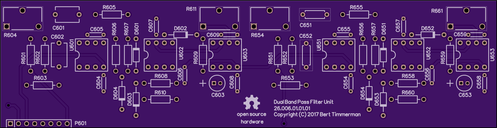
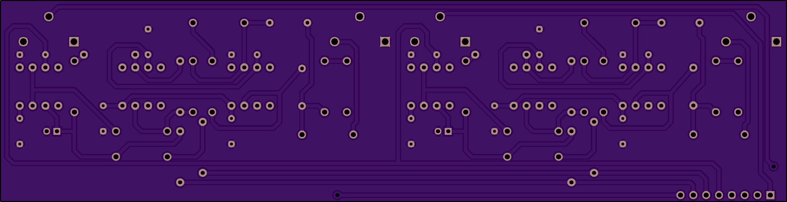
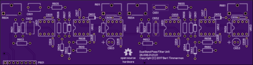
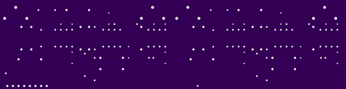
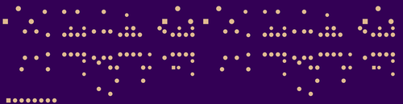
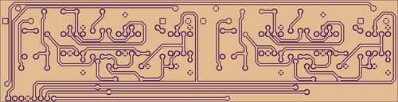
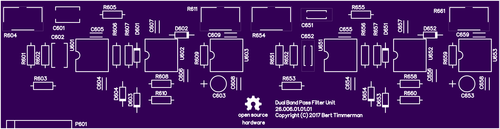
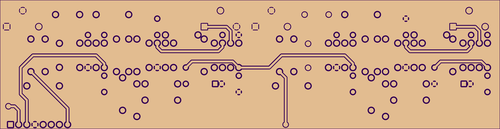

# 26.006.01.01.01

Top.

Bottom.

2 layer board of 6.13 x 1.58 inches (155.8 x 40.2 mm)

Uploaded: August 26th, 2017 20:48

Total price: $48.50 (3 pieces)

# UNTESTED: Dual Band Pass Filter daughter board (PTH) rev. 1.

## Bill Of Materials

refdes | value   | mfg       | mfg_PN                 | vendor | vendor_PN                                               | remarks
-------|---------|-----------|------------------------|--------|---------------------------------------------------------|--------
C601   | 220nF   | Kemet     | R82DC3220AA60K         | Conrad | [1235241](https://www.conrad.com/ce/en/product/1235241) |
C602   | 220nF   | Kemet     | R82DC3220AA60K         | Conrad | [1235241](https://www.conrad.com/ce/en/product/1235241) |
C603   | 1uF     | Yageo     | SE160M1R00B2F-0511     | Conrad | [445639](https://www.conrad.com/ce/en/product/445639)   |
C604   | 100nF   | Holystone | RDCX104K050DKA         | Conrad | [531855](https://www.conrad.com/ce/en/product/531855)   |
C605   | 100nF   | Holystone | RDCX104K050DKA         | Conrad | [531855](https://www.conrad.com/ce/en/product/531855)   |
C606   | 100nF   | Holystone | RDCX104K050DKA         | Conrad | [531855](https://www.conrad.com/ce/en/product/531855)   |
C607   | 100nF   | Holystone | RDCX104K050DKA         | Conrad | [531855](https://www.conrad.com/ce/en/product/531855)   |
C608   | 100nF   | Holystone | RDCX104K050DKA         | Conrad | [531855](https://www.conrad.com/ce/en/product/531855)   |
C609   | 100nF   | Holystone | RDCX104K050DKA         | Conrad | [531855](https://www.conrad.com/ce/en/product/531855)   |
C651   | 100nF   | Epcos     | B32560J1104K***        | Conrad | [501047](https://www.conrad.com/ce/en/product/501047)   |
C652   | 100nF   | Epcos     | B32560J1104K***        | Conrad | [501047](https://www.conrad.com/ce/en/product/501047)   |
C653   | 1uF     | Yageo     | SE160M1R00B2F-0511     | Conrad | [445639](https://www.conrad.com/ce/en/product/445639)   |
C654   | 100nF   | Holystone | RDCX104K050DKA         | Conrad | [531855](https://www.conrad.com/ce/en/product/531855)   |
C655   | 100nF   | Holystone | RDCX104K050DKA         | Conrad | [531855](https://www.conrad.com/ce/en/product/531855)   |
C656   | 100nF   | Holystone | RDCX104K050DKA         | Conrad | [531855](https://www.conrad.com/ce/en/product/531855)   |
C657   | 100nF   | Holystone | RDCX104K050DKA         | Conrad | [531855](https://www.conrad.com/ce/en/product/531855)   |
C658   | 100nF   | Holystone | RDCX104K050DKA         | Conrad | [531855](https://www.conrad.com/ce/en/product/531855)   |
C659   | 100nF   | Holystone | RDCX104K050DKA         | Conrad | [531855](https://www.conrad.com/ce/en/product/531855)   |
D601   | 1N4148  | Diotec    | 1N4148                 | Conrad | [162280](https://www.conrad.com/ce/en/product/162280)   |
D602   | 1N4148  | Diotec    | 1N4148                 | Conrad | [162280](https://www.conrad.com/ce/en/product/162280)   |
D603   | 1N4148  | Diotec    | 1N4148                 | Conrad | [162280](https://www.conrad.com/ce/en/product/162280)   |
D604   | 1N4148  | Diotec    | 1N4148                 | Conrad | [162280](https://www.conrad.com/ce/en/product/162280)   |
D651   | 1N4148  | Diotec    | 1N4148                 | Conrad | [162280](https://www.conrad.com/ce/en/product/162280)   |
D652   | 1N4148  | Diotec    | 1N4148                 | Conrad | [162280](https://www.conrad.com/ce/en/product/162280)   |
D653   | 1N4148  | Diotec    | 1N4148                 | Conrad | [162280](https://www.conrad.com/ce/en/product/162280)   |
D654   | 1N4148  | Diotec    | 1N4148                 | Conrad | [162280](https://www.conrad.com/ce/en/product/162280)   |
P601   |         | MPE Garry | 088-1-008-0-S-XS0-1080 | Conrad | [733919](https://www.conrad.com/ce/en/product/733919)   |
R601   | 12k     | Yageo     | MF0207FTE52-12K        | Conrad | [1417580](https://www.conrad.com/ce/en/product/1417580) |
R602   | 2k2     | Yageo     | MF0207FTE52-2K2        | Conrad | [1417611](https://www.conrad.com/ce/en/product/1417611) |
R603   | 2k2     | Yageo     | MF0207FTE52-2K2        | Conrad | [1417611](https://www.conrad.com/ce/en/product/1417611) |
R604   | 5k      | Piher     | PT15LH05 5K            | Conrad | [431222](https://www.conrad.com/ce/en/product/431222)   |
R605   | 120k    | Yageo     | MF0207FTE52-120K       | Conrad | [1417572](https://www.conrad.com/ce/en/product/1417572) |
R606   | 22k     | Yageo     | MF0207FTE52-22K        | Conrad | [1417591](https://www.conrad.com/ce/en/product/1417591) |
R607   | 10k     | Yageo     | MF0207FTE52-10K        | Conrad | [1417569](https://www.conrad.com/ce/en/product/1417569) |
R608   | 15k     | Yageo     | MF0207FTE52-15K        | Conrad | [1417581](https://www.conrad.com/ce/en/product/1417581) |
R609   | 1k      | Yageo     | MF0207FTE52-1K         | Conrad | [1417606](https://www.conrad.com/ce/en/product/1417606) |
R610   | 1M      | Yageo     | MF0207FTE52-1M         | Conrad | [1417625](https://www.conrad.com/ce/en/product/1417625) |
R611   | 10k     | Piher     | PT15LH05 10K           | Conrad | [431230](https://www.conrad.com/ce/en/product/431230)   |
R651   | 12k     | Yageo     | MF0207FTE52-12K        | Conrad | [1417580](https://www.conrad.com/ce/en/product/1417580) |
R652   | 3k9     | Yageo     | MF0207FTE52-3K9        | Conrad | [1417672](https://www.conrad.com/ce/en/product/1417672) |
R653   | 2k2     | Yageo     | MF0207FTE52-2K2        | Conrad | [1417611](https://www.conrad.com/ce/en/product/1417611) |
R654   | 5k      | Piher     | PT15LH05 5K            | Conrad | [431222](https://www.conrad.com/ce/en/product/431222)   |
R655   | 120k    | Yageo     | MF0207FTE52-120K       | Conrad | [1417572](https://www.conrad.com/ce/en/product/1417572) |
R656   | 39k     | Yageo     | MF0207FTE52-39K        | Conrad | [1417634](https://www.conrad.com/ce/en/product/1417634) |
R657   | 10k     | Yageo     | MF0207FTE52-10K        | Conrad | [1417569](https://www.conrad.com/ce/en/product/1417569) |
R658   | 15k     | Yageo     | MF0207FTE52-15K        | Conrad | [1417581](https://www.conrad.com/ce/en/product/1417581) |
R659   | 1k      | Yageo     | MF0207FTE52-1K         | Conrad | [1417606](https://www.conrad.com/ce/en/product/1417606) |
R660   | 1M      | Yageo     | MF0207FTE52-1M         | Conrad | [1417625](https://www.conrad.com/ce/en/product/1417625) |
R661   | 10k     | Piher     | PT15LH05 10K           | Conrad | [431230](https://www.conrad.com/ce/en/product/431230)   |
U601   | CA3140E | Intersil  | CA3140E                | Conrad | [174785](https://www.conrad.com/ce/en/product/174785)   |
U602   | CA3140E | Intersil  | CA3140E                | Conrad | [174785](https://www.conrad.com/ce/en/product/174785)   |
U603   | CA3140E | Intersil  | CA3140E                | Conrad | [174785](https://www.conrad.com/ce/en/product/174785)   |
U651   | CA3140E | Intersil  | CA3140E                | Conrad | [174785](https://www.conrad.com/ce/en/product/174785)   |
U652   | CA3140E | Intersil  | CA3140E                | Conrad | [174785](https://www.conrad.com/ce/en/product/174785)   |
U653   | CA3140E | Intersil  | CA3140E                | Conrad | [174785](https://www.conrad.com/ce/en/product/174785)   |

# Verify your design

## Board Top

This shows the final manufactured board as if you held it in your hand.

Your design should show gold copper, purple mask, white silk, black drills, and the board outline.

Internal cutouts are indicated by a black outline but are not filled in.

If the image here is entirely white, you'll want to find and fix any gaps in the board outline.

There should be no dimension or measurement ruler.

## Board Bottom

This shows the final manufactured board as if you held it in your hand.

Your design should show gold copper, purple mask, white silk, black drills, and the board outline.

Internal cutouts are indicated by a black outline but are not filled in.

If the image here is entirely white, you'll want to find and fix any gaps in the board outline.

There should be no dimension or measurement ruler.

## Drills

Rendered from "26.006.01.01.01.XLN"

Drills should show up as white circles on a purple background.

We want a single merged drill file exported in Excellon or NC Drills format with 2:4 precision, absolute coordinates, and no zero suppression.

We will merge multiple drill files into one file and only plate the holes which pass through copper.

Drills smaller than our minimums will be increased to the minimum size, see the [design rules](https://docs.oshpark.com/submitting-orders/drill-specs/).

- No overlapping drill hits.

- No blind or buried vias.

- Small slots and plated slots are not supported. See our [slots page](http://docs.oshpark.com/troubleshooting/cutouts-and-slots/).

- No oval or other non-circular drills.

We have more info on our [drills help page](http://docs.oshpark.com/submitting-orders/drill-specs/).

## Top Solder Mask

Rendered from "26.006.01.01.01.GTS"

Soldermask layers show us where to remove the purple solder resist. The gold-colored areas will be exposed on the final board, and purple areas will be covered.

If you submitted an empty file, we won't remove any mask so this entire side of the board will be covered in purple soldermask.

To expose the entire board, submit this file with a single polygon that covers the entire board. We will remove all mask everywhere and expose all the copper and board substrate.

## Bottom Layer

Rendered from "26.006.01.01.01.GBL"

This layer should appear 'mirrored' as if you were looking down on it through the board from the top.

We will place copper everywhere we see gold color on this layer.

If you are using Altium Designer or Altium CircuitMaker, carefully examine the board to make sure there are no shorts from the mechanical layers being included on this layer. See [here](http://docs.oshpark.com/design-tools/altium-designer/) for more.

If you are using Eagle, be aware that airwires are not the same as routed traces. If there are no copper links between pads showing on this layer, please review your .brd file for airwires.

See our [design tools pages](http://docs.oshpark.com/design-tools/) for more.

## Bottom Solder Mask

Rendered from "26.006.01.01.01.GBS"

This layer should appear 'mirrored' as if you were looking down on it through the board from the top.

Soldermask layers show us where to remove the purple solder resist. The gold-colored areas will be exposed on the final board, and purple areas will be covered.

If you submitted an empty file, we won't remove any mask so this entire side of the board will be covered in purple soldermask.

To expose the entire board, submit this file with a single polygon that covers the entire board. We will remove all mask everywhere and expose all the copper and board substrate.
 
## Board Outline

Rendered from "26.006.01.01.01.GKO"

The board outline should be a watertight (no gaps) purple outline showing at least the edge of the board with no gaps.

The outline layer can also show large drill holes and cutouts. See the [outline instructions](http://docs.oshpark.com/submitting-orders/board-outline/) for more.

We can cut non-rectangular board shapes, but you’ll be billed for the smallest rectangle to encompass the design. A circular board with a two-inch diameter would cost the same as a square of four square inches.

We don’t offically support cutouts or plated slots, but they usually come out okay if you follow the [cutouts and slots instructions](http://docs.oshpark.com/troubleshooting/cutouts-and-slots/).

## Top Silk Screen

Rendered from "26.006.01.01.01.GTO"

We will ignore the portion of the silkscreen that extends beyond the board outline.

We will automatically remove any silkscreen that crosses drilled holes or exposed copper.

If a logo isn't showing up on this layer, try changing your design tool import settings to create that silk image with 400 DPI or less, or check out our [Eagle-specific import-bmp script]((http://docs.oshpark.com/troubleshooting/import-bmp/)) instructions.

## Top Layer

Rendered from "26.006.01.01.01.GTL"

We will place copper everywhere we see gold color on this layer.

If you are using Altium Designer or Altium CircuitMaker, carefully examine the board to make sure there are no shorts from the mechanical layers being included on this layer. See [here](http://docs.oshpark.com/design-tools/altium-designer/) for more.

If you are using Eagle, be aware that airwires are not the same as routed traces. If there are no copper links between pads showing on this layer, please review your .brd file for airwires.

See our [design tools pages](http://docs.oshpark.com/design-tools/) for more.

