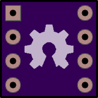
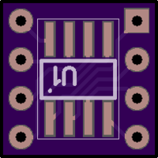

.

# 26.004.00 Main board cover and shielding.

**DO NOT ORDER** (Work In Progress).

# 26.006.00 Band pass filter daughter board.

First PTH version.

**DO NOT ORDER** : contains a connection (polarity) error on all operational amplifiers.

Top view:

Bottom view:

[Project description](26-006-00/README.md)

# 26.006.01 Band pass filter daughter board.

Debugged PTH version (**DO NOT ORDER** Work In Progress).

# 26.006.02 Band pass filter daughter board.

First SMT version (**DO NOT ORDER** Work In Progress).

# 26.999.00 SOIC8 - DIP08300 Breakout Board.

**DO NOT ORDER** : Work In Progress.

Top view:

Bottom view:

[Project description](26-999-00/README.md)

[Download](https://644db4de3505c40a0444-327723bce298e3ff5813fb42baeefbaa.ssl.cf1.rackcdn.com/28610e09c89701eb2a626645b83d8dd6.zip)

[OSH Park Permalink](https://oshpark.com/shared_projects/yK5TL8nq)

